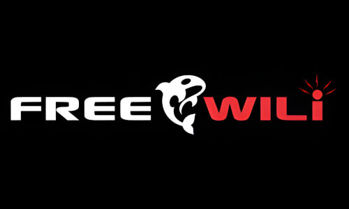

# FREE-WiLi Overview

<!-- 
 
   

 -->

<figure>

<figcaption>Make Embedded Systems Fun Again.</figcaption>
</figure>

## Overview

FREE-WiLi is a embedded development tool for helping test, debug, and develop electronic systems.

## Use Cases

- I2C USB interface
- SPI USB interface
- UART USB interface
- USB attached screen and buttons
- Uart based protocol tool support (cxpi, sent, flexwire)
- TPMS fuzzer or simulator
- Keyless Entry simulator/monitor
- Development platform that 80% done
- TI Wireless Battery Management
- Interface for:
  - 6LoWPAN
  - Amazon Sidewalk
  - IEEE 802.15.4
  - MIOTY
  - Proprietary 2.4 GHz
  - Thread
  - Wi-SUN NWP
  - Wireless M-Bus
  - Zigbee
- Learning platform for Embedded Systems

## Features

- SPI, I2C, PIO, and UART available on [GPIO](/gpio)
- 3 USB interfaces (Integrated HUB with 2 FS, 1 HS) for communication and power
- 11 GPIO programmable voltage level for 1.1 to 5.5V with 24mA @ 3V or 32mA @ 5V (sn74lxc1t45)
- 2 GPIO for I2C voltage level between 0.9V to 5.5V with software enabled pulls (PCA9517)
- GPIO front end includes ICE40UP5k [FPGA](/ice40-fpga/ice40-fpga-overview) with 8MByte SRAM and High Speed USB (FT232H)
- Two SMA connectors for antenna for longer range
- 320 x 240 Color Display
- 5 User configurable buttons
- 7 Full color LEDs
- IR transmitter and receiver
- Digital Speaker and Microphone
- Raspberry Pi Pico (RP2040) Open Micro Platform for specific applications or custom code
- [Orca](/extending-with-orcas) modules plug into GPIO header allow expandability for specific use case
- [IO App](/io-app) firmware allows exercising all IO, USB Host API and Standalone scripting
- 16 Mbyte x 2 on board storage
- 1000 ma Lithium ION battery with integrated charger
- Real Time Clock (RTC)

## Radio Versions

<figure>

<figcaption>FREE-WiLi contains two radios.</figcaption>
</figure>

FREE-WiLi has 4 different radio options:

**Black**  contains two CC1101 Sub Ghz Radios with programmable filter ranges for 300-348, 387-464, 779-928 bands.

**Red** contains two CC1352P7 MCUs with Sub Ghz Radio and 2.4 Ghz radios with high level support for 6LoWPAN, Amazon Sidewalk, IEEE 802.15.4, MIOTY, Proprietary 2.4 GHz, Thread, Wi-SUN NWP, Wireless M-Bus, Zigbee

**Purple** contains two CC2662 MCUs for supporting and testing TI Wireless BMS Applications

**Blue** contains no radio for lower cost applications or applications where radios are not permitted.